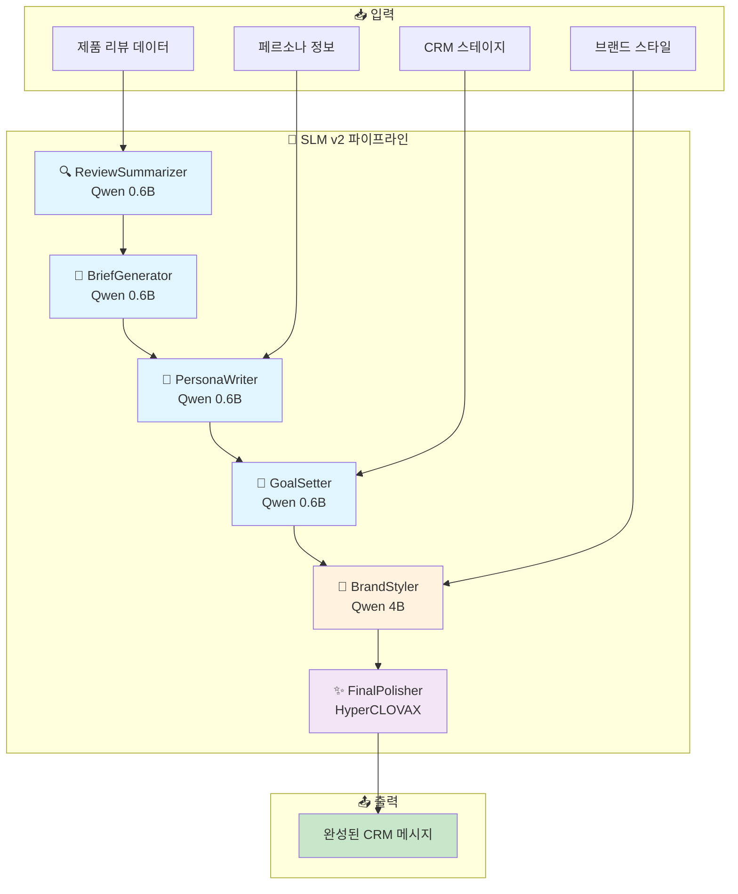
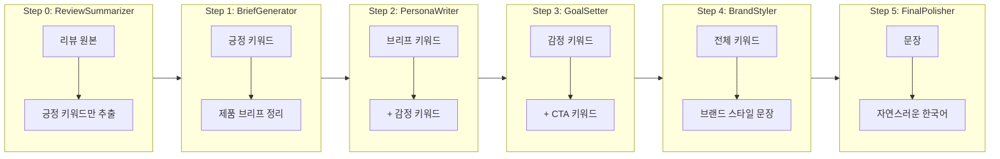
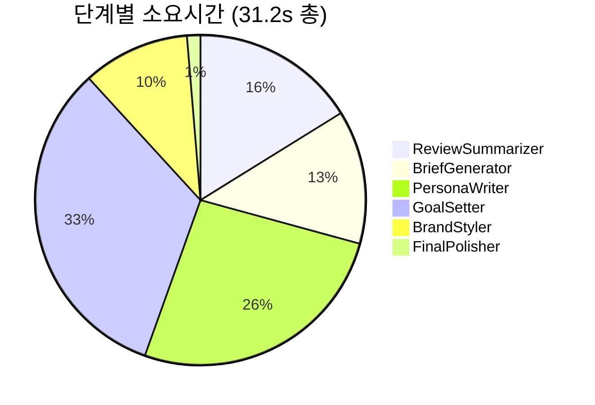
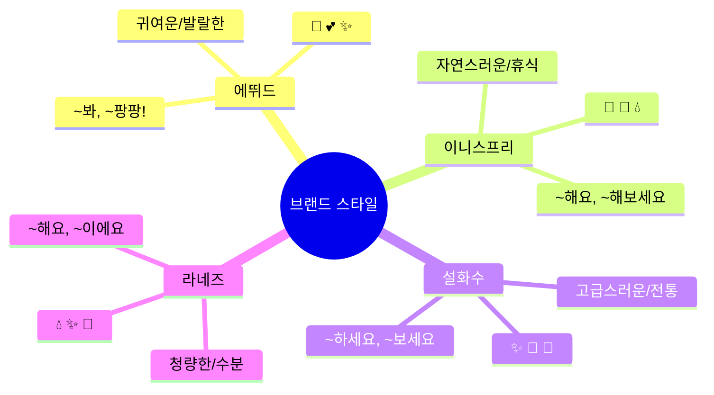

# SLM v2 파이프라인 상세 문서

> **성공 사례:** 이니스프리 블랙티 에센스 → "🌿 흡수율이 높은 화산송이 기초로, 피부결을 자연스럽게 정리해보세요! 🧴"

---

## 🏗️ 파이프라인 아키텍처



---

## 📊 실제 예시: 이니스프리 블랙티 에센스

| 항목 | 값 |
|------|-----|
| **브랜드** | 이니스프리 |
| **제품** | 블랙티 유스 인핸싱 트리트먼트 에센스 75ml |
| **페르소나** | Natural_Beauty |
| **스테이지** | Activation |
| **총 소요시간** | 31.2초 |

---

## 🔄 단계별 데이터 흐름



---

## 📝 단계별 상세

### Step 0: ReviewSummarizer (3.7s)
**역할:** 리뷰에서 긍정적인 키워드만 추출  
**모델:** Qwen 0.6B

| Input | Output |
|-------|--------|
| 리뷰 원문 (보습, 흡수력 좋음, 피부결...) | `흡수율, 화산송이, 보습, 기초, 피부결 정리` |

---

### Step 1: BriefGenerator (3.0s)
**역할:** 키워드를 제품 브리프 형태로 정리  
**모델:** Qwen 0.6B

| Input | Output |
|-------|--------|
| `흡수율, 화산송이, 보습, 기초, 피부결 정리` | `흡수율, 화산송이, 보습, 기초, 피부결 정리` |

---

### Step 2: PersonaWriter (6.0s)
**역할:** 페르소나 맞춤 감정 키워드 추가  
**모델:** Qwen 0.6B

**페르소나:** Natural_Beauty → 감정 키워드: `자연스러운, 건강한, 순수한`

| Input | Output |
|-------|--------|
| `흡수율, 화산송이, 보습, 기초, 피부결 정리` | `흡수율, 화산송이, 보습, 기초, 피부결 정리, 자연스러운, 건강한, 순수한` |

---

### Step 3: GoalSetter (7.5s)
**역할:** CRM 목적에 맞는 CTA 키워드 추가  
**모델:** Qwen 0.6B

**스테이지:** Activation → CTA 키워드: `오늘시작, 체험, 도전`

| Input | Output |
|-------|--------|
| `...자연스러운, 건강한, 순수한` | `...자연스러운, 건강한, 순수한, 오늘시작, 체험, 도전` |

---

### Step 4: BrandStyler (2.4s) ⭐
**역할:** 키워드를 브랜드 스타일 문장으로 조합  
**모델:** Qwen 4B (핵심 스텝!)

**브랜드 스타일 (이니스프리):**
```
어미: ~해요, ~해보세요, ~이에요
이모지: 🌿 🧴 💧
분위기: 자연스러운, 휴식
```

| Input | Output |
|-------|--------|
| 전체 키워드 (10개) | `🌿 흡수율이 높은 화산송이 기초로, 피부결을 자연스럽게 정리해보세요! 🧴` |

---

### Step 5: FinalPolisher (0.3s)
**역할:** 번역투 제거 및 자연스러운 한국어로 윤문  
**모델:** HyperCLOVAX 0.5B

| Input | Output |
|-------|--------|
| `🌿 흡수율이 높은 화산송이 기초로...` | `🌿 흡수율이 높은 화산송이 기초로, 피부결을 자연스럽게 정리해보세요! 🧴` |

---

## ⏱️ 성능 분석



| 단계 | 소요시간 | 비율 |
|------|----------|------|
| ReviewSummarizer | 3.7s | 12% |
| BriefGenerator | 3.0s | 10% |
| PersonaWriter | 6.0s | 19% |
| GoalSetter | 7.5s | 24% |
| BrandStyler | 2.4s | 8% |
| FinalPolisher | 0.3s | 1% |

---

## 🎨 브랜드별 스타일 설정



---

## 🚀 사용법

```bash
# 이니스프리 - Natural_Beauty 페르소나 - Activation 스테이지
python src/run_slm_v2.py --persona 4 --brand 이니스프리 --product "블랙티" --stage_index 1

# 에뛰드 - Sensitive_Skin 페르소나 - Acquisition 스테이지
python src/run_slm_v2.py --persona 1 --brand 에뛰드 --product "콜라겐 토너" --stage_index 0

# 설화수 - Luxury_Lover 페르소나 - Retention 스테이지
python src/run_slm_v2.py --persona 0 --brand 설화수 --product "자음생크림" --stage_index 2
```

**파라미터:**
- `--persona`: 0=Luxury_Lover, 1=Sensitive_Skin, 2=Budget_Seeker, 3=Trend_Follower, 4=Natural_Beauty
- `--stage_index`: 0=Acquisition, 1=Activation, 2=Retention, 3=Revenue, 4=Referral
- `--brand`: 에뛰드, 이니스프리, 설화수, 라네즈, 아이오페, 마몽드
- `--product`: 제품명 (부분 일치 검색 가능)
